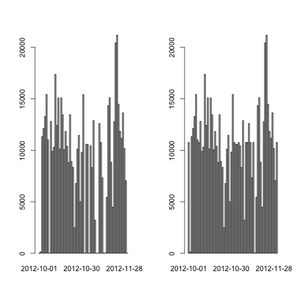
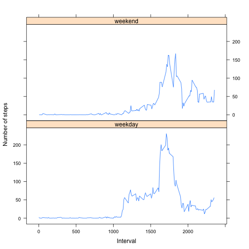

# Reproducible Research: Peer Assessment 1

Set the global options

```r
require(knitr)
opts_chunk$set(echo = TRUE)
```


## Loading and preprocessing the data
**Question : Load the data (i.e. read.csv()) and process/transform the data (if necessary) into a format suitable for your analysis**

We need to install and load the "RCurl" package for the function "getBinaryURL"

```r
require(RCurl)
```

```
## Loading required package: RCurl
```


Load the data

```r
if (!file.exists("activity.csv")) {
    bin <- getBinaryURL("http://d396qusza40orc.cloudfront.net/repdata%2Fdata%2Factivity.zip", 
        ssl.verifypeer = FALSE)
    con <- file("activity.zip", open = "wb")
    writeBin(bin, con)
    close(con)
    unzip("activity.zip")
    
}
activity <- read.csv("activity.csv", colClasses = c("numeric", "Date", "numeric"))
```


## What is mean total number of steps taken per day?
**Question : Make a histogram of the total number of steps taken each day**

Calculate the number of steps per day

```r
by_day <- tapply(activity$steps, activity$date, FUN = sum, na.rm = TRUE)
```

Here is the barplot of the number of steps per day

```r
barplot(by_day)
```

 


**Question : Calculate and report the mean and median total number of steps taken per day**

Calculate and report the mean of total number of steps 

```r
mean_by_day <- mean(by_day)
print(mean_by_day)
```

```
## [1] 9354
```


Calculate and report the median of total number of steps 

```r
median_by_day <- median(by_day)
print(median_by_day)
```

```
## [1] 10395
```


## What is the average daily activity pattern?
**Question : Make a time series plot (i.e. type = "l") of the 5-minute interval (x-axis) and the average number of steps taken, averaged across all days (y-axis)**

Calculate the average number of steps per 5-minute interval

```r
by_interval_mean <- tapply(activity$steps, activity$interval, FUN = mean, na.rm = TRUE)
```


Here is the plot of the average number of steps per 5-minute interval

```r
plot(unique(activity$interval), by_interval_mean, type = "l", xlab = "5-minute interval", 
    ylab = "Average number of steps")
```

 


**Question : Which 5-minute interval, on average across all the days in the dataset, contains the maximum number of steps?**

Calculate and report the 5-minute interval with the maximum number of steps

```r
by_interval_mean_aggregated <- aggregate(steps ~ interval, activity, mean)
by_interval_mean_aggregated[by_interval_mean_aggregated$steps == max(by_interval_mean_aggregated$steps), 
    ]
```

```
##     interval steps
## 104      835 206.2
```


## Imputing missing values
**Question : Calculate and report the total number of missing values in the dataset (i.e. the total number of rows with NAs)**

Calculate and report the total number of missing values

```r
sum(is.na(activity))
```

```
## [1] 2304
```


**Question : Devise a strategy for filling in all of the missing values in the dataset. The strategy does not need to be sophisticated. For example, you could use the mean/median for that day, or the mean for that 5-minute interval, etc.**

We need to install and load the "plyr" package

```r
library(plyr)
```


Create function "replace.mean" to replace the means. 

```r
replace.mean <- function(x) replace(x, is.na(x), mean(x, na.rm = TRUE))
```


**Question : Create a new dataset that is equal to the original dataset but with the missing data filled in.**

Run through the dataset and replace the NA's with ddply.  The name of the new dataset is "activity_cleaned"

```r
activity_cleaned <- ddply(activity, ~interval, transform, steps = replace.mean(steps))
```


**Question : Make a histogram of the total number of steps taken each day and Calculate and report the mean and median total number of steps taken per day. Do these values differ from the estimates from the first part of the assignment? What is the impact of imputing missing data on the estimates of the total daily number of steps?**

Calculate the number of steps per day from the new cleaned dataset

```r
by_day_cleaned <- tapply(activity_cleaned$steps, activity_cleaned$date, FUN = sum, 
    na.rm = TRUE)
```


Here are the 2 barplots , and there are differences (left=original data ; right = cleaned data)

```r
par(mfrow = c(1, 2))
barplot(by_day)
barplot(by_day_cleaned)
```

 


Calculate and report the mean of total number of steps from the new cleaned dataset

```r
mean_by_day_cleaned <- mean(by_day_cleaned)
```


Calculate and report the median of total number of steps from the new cleaned dataset

```r
median_by_day_cleaned <- median(by_day_cleaned)
```


Comparison of means and medians, there is a difference by imputing means at the missing data

```r
comparison <- data.frame(old = c(mean_by_day, median_by_day), new = c(mean_by_day_cleaned, 
    median_by_day_cleaned))
row.names(comparison) <- c("mean", "median")
print(comparison)
```

```
##          old   new
## mean    9354 10766
## median 10395 10766
```


## Are there differences in activity patterns between weekdays and weekends?

**For this part the weekdays() function may be of some help here. Use the dataset with the filled-in missing values for this part.**

**Question : Create a new factor variable in the dataset with two levels – “weekday” and “weekend” indicating whether a given date is a weekday or weekend day.**

Add the factor variable "day_type" with weekend and weekday.

```r
activity_cleaned$day_type <- factor(ifelse(as.POSIXlt(activity_cleaned$date)$wday%%6 == 
    0, "weekend", "weekday"))
```


**Question : Make a panel plot containing a time series plot (i.e. type = "l") of the 5-minute interval (x-axis) and the average number of steps taken, averaged across all weekday days or weekend days (y-axis).**

We need to install and load the "lattice" package for the plot

```r
require(lattice)
```


Make aggregated data of the mean by day_type and interval

```r
by_interval_mean_cleaned <- aggregate(activity_cleaned$steps, list(day_type = activity_cleaned$day_type, 
    interval = activity_cleaned$interval), FUN = mean)
```


Here is the panel plot with time series of 5-minute interval (x-axis) and the average number of steps (y-axis) averaged across all weekday days or weekend days

```r
xyplot(x ~ unique(interval) | day_type, data = by_interval_mean_cleaned, type = "l", 
    xlab = "Interval", ylab = "Number of steps", layout = c(1, 2))
```

 

